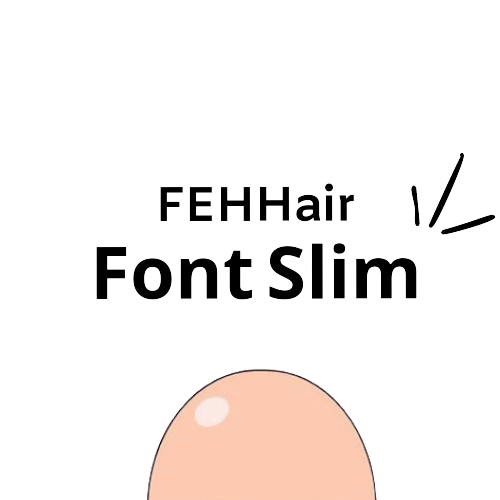

> [!WARNING]
> 此项目正在开发阶段！🚧

<p align="center">
  
</p>
<h1 align="center">FontSlim </h1>
<p align="center">字体文件提取.</p>
<p align="center"><b>提取所需的字体文件，减小它们的体积，优化项目资源。</b></p>
<p align="center">

</p>

### 简介
在日常项目中，有一些UI同学经常搞一些其他字体来美化界面，而这种特殊的字体绝大多数情况下仅限于`数字`与`字母`，汉字几乎不会使用，因此，当我们引进整个字体包时，对项目来说是非常冗余的。

font-slim 是一个基于 `fontmin` 封装的字体过滤工具，主要用来过滤无用字体，大幅减小字体包大小。

### 安装依赖

```bash
pnpm install
```

## License

[MIT](./LICENSE)

## CHANGELOG

[CHANGELOG]('./CHANGELOG')

## Author

[HoMeTown](https://juejin.cn/user/4116184668057390) 🙊
